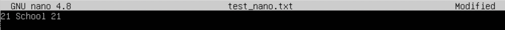
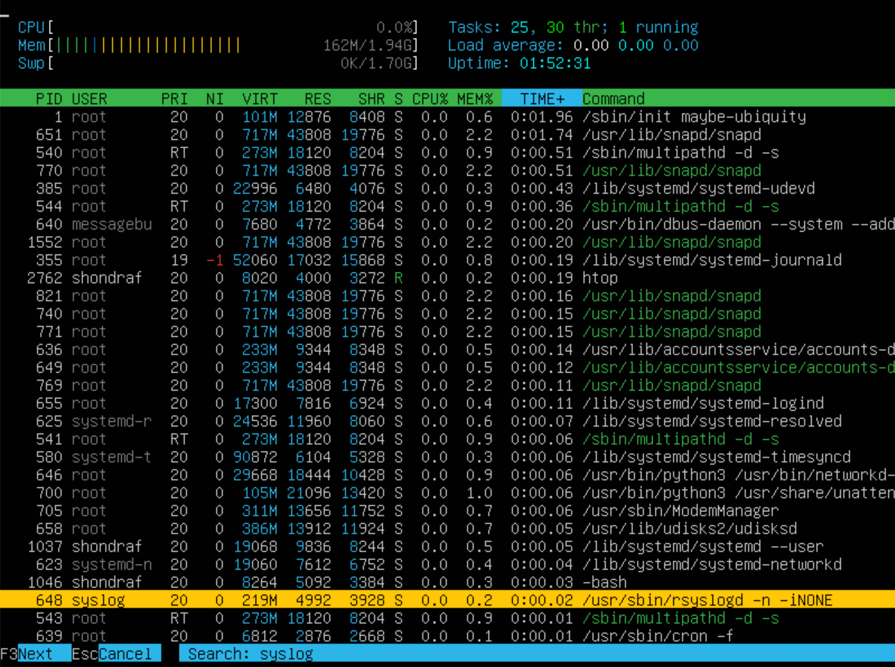

# Операционные системы UNIX/Linux (Базовый)
## Part 1. Установка ОС

* Была установилена Ubuntu 20.04 Server LTS без графического интерфейса, и выполнена команда "cat /etc/issue" (рисунок 1.1).

 

Рисунок 1.1 - Версия Ubuntu
 

## Part 2. Создание пользователя

* Был создан новый пользователь user1 с помощью команды "sudo adduser vika" (рисунок 2.1). Далее пользователь был добавлен в группу adm с помощью команды "sudo adduser vika adm" (рисунок 2.2). Было проверено наличие нового пользователя с помощью команды "cat /etc/passwd" (рисунок 2.3).

 

Рисунок 2.1 - Создание пользователя
 

Рисунок 2.2 - Добавление пользователя в группу adm
 

Рисунок 2.3 - Проверка наличия нового пользователя
 

## Part 3. Настройка сети ОС
 

* Было задано название машины вида user-1 с помощью команды "hostname set-hostname user-1" (рисунок 3.1).

 

Рисунок 3.1 - Название машины вида user-1
 

* Была установилена временная зона по текущему местоположению с помощью команды "sudo dpkg-reconfigure tzdata". В результате даной команды появилось меню настроек (рисунок 3.2). В географигеском районе была выбрана "Европа", а в часовом поясе - "Москва" (рисунок 3.3). Был выведен результат (рисунок 3.4).

 

Рисунок 3.2 - Выбор географигеского района
 

Рисунок 3.3 - Выбор часового пояса
 

Рисунок 3.4 - Результат
 

* Были выведены названия сетевых интерфейсов с помощью команды "ifconfig -a" (рисунок 3.5).

 

Рисунок 3.5 - Выбор географигеского района
 

>"lo" - loopback - канал коммуникации с одной конечной точкой. Любые сообщения, посылаемые на этот канал, немедленно принимаются тем же самым каналом. Любые сообщения, которые отправляются с этого интерфейса, но у которых адрес не Loopback Interface, отбрасываются. Также саму технологию используют для тестирование передачи данных от обслуживающего центра коммутации, проверки сигнала на расстоянии, обеспечение работы коммутационных кабелей и их проверка, теста обратной петли, когда сигнал посылается и возвращается отправителю по всем коммуникационным каналам.

 

* Был получен ip адрес устройства от DHCP сервера с помощью команды "hostname -I" (рисунок 3.6).

 

Рисунок 3.6 - IP адрес устройства
 

> DHCP расшифровывается как Dynamic Host Configuration Protocol, позволяющий устройствам в сети автоматически получать IP-адреса и другие параметры при обращении к DHCP-серверу.

 

* Был определен внешний ip-адрес шлюза с помощью команды "wget -O - -q icanhazip.com" (рисунок 3.7) и внутренний IP-адрес шлюза, он же ip-адрес по умолчанию с помощью команды "ip route" (рисунок 3.8).

 

Рисунок 3.7 - Внешний IP-адрес шлюза
 

Рисунок 3.8 - Внутренний IP-адрес шлюза
 

* Были заданы статичные настройки ip, gw, dns в конфигурационном файле через редактор вим,  который был открыт с помощью команды "sudo vi /etc/netplan/00-installer-config.yaml" (рисунок 3.9).

 

Рисунок 3.9 - Произведенные зменения в редакторе вим
 

* Далее с помощью команды "sudo netplan apply" конфигурация была применяна к системе, и была произведена проверка изменений (рисунок 3.10). был пропингован хост 1.1.1.1 с помощью команды "ping -c 10 1.1.1.1" (рисунок 3.11) и ya.ru с помощью команды "ping -c 10 ya.ru" (рисунок 3.12).

 

Рисунок 3.10 - Проверка изменений
 

Рисунок 3.11 - Пинг хоста 1.1.1.1
 

Рисунок 3.12 - Пинг хоста ya.ru
 

## Part 4. Обновление ОС
 

* Были просмотрены системные пакеты, которые можно обновить до последней версии с помощью команды "sudo apt update" (рисунок 4.1), и далее они были обновлены с помощью команды "sudo apt full-upgrade" (рисунок 4.2). После обновления системных пакетов были введены те же команды обновления повторно для проверки (рисунок 4.3).

 

Рисунок 4.1 - Количество пакетов для обновления
 

Рисунок 4.2 - Обновление пакетов
 

Рисунок 4.3 - Проверка обновления
 

## Part 5. Использование команды sudo
 

* Было разрешено пользователю vika выполнять команду sudo с помощью команды "sudo usermod -a -G sudo vika", и был сменен пользователь с помощью команды "su - vika" (рисунок 5.1). Далее был изменен хост с помощью команды "sudo hostname set-hostname user-2" (рисунок 5.2).

 

Рисунок 5.1 - Передача прав sudo
 

Рисунок 5.2 - Изменение хоста
 

 > Команда sudo предоставляет возможность пользователям выполнять команды от имени суперпользователя root, либо других пользователей.

 

## Part 6. Установка и настройка службы времени
 

* Было выведено время часового пояса с помощью команды "timedatectl show" (рисунок 6.1).

 

Рисунок 5.1 - Время часового пояса
 

## Part 7. Установка и использование текстовых редакторов
 

* Был установлен текстовый редактор emacs с помощью команды "sudoapt install emacs". Редакторы vim и nano уже были установлены.

* Были созданы и открыты файлы в трех текстовых редакторах, в них был написан и сохранен текст:
    1. Vim (рисунок 7.1). C помощью команды :wq файл был закрыт с сохранением.
    2. Nano (рисунок 7.2). C помощью команды ctrl+s файл был сохранен, а с помощью ctrl+x закрыт.
    3. Emacs (рисунок 7.3). C помощью команд ctrl+x, ctrl+s, enter файл был сохранен, а с помощью ctrl+x, ctrl+c, enter закрыт.

 

Рисунок 7.1 - Сохранение в vim
 

Рисунок 7.2 - Сохранение в nano
 

Рисунок 7.2 - Сохранение в emacs
 

* Были повторно открыты файлы в трех текстовых редакторах, в них был изменен и несохранен новый текст:
    1. Vim (рисунок 7.4). C помощью команды :q! файл был закрыт без сохранения.
    2. Nano (рисунок 7.5). C помощью команды ctrl+x, а потом подтверждения N файл был закрыт.
    3. Emacs (рисунок 7.6). C помощью команд ctrl+x, ctrl+c, enter, а потом подтверждения no файл был закрыт.

 

Рисунок 7.4 - Изменения в vim
 

Рисунок 7.5 - Изменения в nano
 

Рисунок 7.6 - Изменения в emacs
 

* Были повторно открыты файлы в трех текстовых редакторах, в них был произведен поиск и замена:
    1. Vim. C помощью команды "/*текст*" был произведен поиск (рисунок 7.7). C помощью команды ":%s/*что заменить*/*на что заменить*/g" была произведена замена (рисунок 7.8). 
    2. Nano. C помощью команды ctrl+q был произведен поиск (рисунок 7.9). C помощью команды ctrl+\ была произведена замена (рисунок 7.10).
    3. Emacs. C помощью команды ctrl+s был произведен поиск (рисунок 7.11). C помощью команды shift+option+5 была произведена замена (рисунок 7.12).

 

Рисунок 7.7 - Поиск в vim
 

Рисунок 7.8 - Замена в vim
 

Рисунок 7.9 - Поиск в nano
 

Рисунок 7.10 - Замена в nano
 

Рисунок 7.11 - Поиск в emacs
 

Рисунок 7.12 - Замена в emacs
 

## Part 8. Установка и базовая настройка сервиса SSHD
 

* Была установлена служба SSHd c помощью команды "sudo apt install openssh-server".

* Был добавлен автостарт службы при загрузке системы c помощью команды "sudo systemctl enable ssh".

* Через конфигурационный файл был изменен порт SSHd на 2022. Файл был открыт c помощью команды "sudo vim /etc/ssh/sshd_config" (рисунок 8.1). Далее были активированы изменения с помощью команды "/etc/init.d/ssh restart" и выведена команда "netstat -tan" (рисунок 8.2).

 

Рисунок 8.1 - Файл sshd_config
 

Рисунок 8.2 - Проверка
 

> Флаг "t" нужен для отображения tcp-портов. 
Флаг "n" служит для вывода IP-адресов вместо имен хостов.
Флаг "a" позволяет посмотреть состояние всех сокетов.

 

* Для показа наличия процесса sshd была использована команда "ps aux | grep sshd" (рисунок 8.3).

 

Рисунок 8.3 - Процесс sshd
 

> Флаг "a" - выводит на дисплей процессы всех пользователей, за исключением тех процессов, которые не связаны с терминалом и процессами группы лидеров.
Флаг "u" - выводит на дисплей подставки для ориентированных на пользователя формате, который обеспечивает подробную информацию о процессах.
Флаг "x" - перечисляет процессы без управляющего терминала. В основном это процессы, которые запускаются во время загрузки и работают в фоновом режиме.

 

## Part 9. Установка и использование утилит top, htop
 

* Была запущена утилита top (рисунок 9.1). В ней было найдено:
    * uptime - 26 min
    * количество авторизованных пользователей - 1
    * общая загрузка системы - 0.00, 0.00, 0.00
    * общее количество процессов - 95
    * загрузка cpu - 3 строчка
    * загрузку памяти - 4 и 5 строчка
    * pid процесса занимающего больше всего памяти с помощью нажатия Shift+M - 651 (рисунок 9.2)
    * pid процесса, занимающего больше всего процессорного времени с помощью нажатия Shift+T - 1794 (рисунок 9.3)

 

Рисунок 9.1 - Утилита top
 

Рисунок 9.2 - Pid процесса занимающего больше всего памяти
 

Рисунок 9.3 - Pid процесса, занимающего больше всего процессорного времени
 

* Была запущена утилита htop. В ней было сделано:
    * сортировка с помощью нажатия F6 и выбора позиции (рисунок 9.4):
        * PID (рисунок 9.5)
        * PERCENT_CPU (рисунок 9.6)
        * PERCENT_MEM (рисунок 9.7)
        * TIME (рисунок 9.8)
    * фильтрация для процесса sshd с помощью нажатия F4 (рисунок 9.9)
    * поиск процесса syslog с помощью нажатия F3 (рисунок 9.10)
    * добавлены hostname, clock с помощью нажатия F2 (рисунок 9.11)

 

Рисунок 9.4 - Выбор сортировки (слева)
 

Рисунок 9.5 - Сортировка по PID
 

Рисунок 9.6 - Сортировка по PERCENT_CPU
 

Рисунок 9.7 - Сортировка по PERCENT_MEM
 

Рисунок 9.8 - Сортировка по TIME
 

Рисунок 9.9 - Фильтрация для процесса sshd
 

Рисунок 9.10 - Поиск процесса syslog
 

Рисунок 9.11 - Добавление hostname, clock
 

## Part 10. Использование утилиты fdisk
 

* Была запущена команда "fdisk -l" (рисунок 10.1). Было найдено:
    * название жесткого диска - /dev/sda
    * размер жесткого диска - 10 ГБ
    * количество секторов жесткого диска - 20971520
    * размер swap - 1,7 ГБ с помощью команды "free -h" (рисунок 10.2)

 

Рисунок 10.1 - Параметры жесткого диска
 

Рисунок 10.2 - Параметры swap
 

## Part 11. Использование утилиты df
 

* Была запущена команда "df" (рисунок 11.1). Единица измерения в выводе - КБ. Было найдено для корневого раздела (/):
    * размер раздела - 9299276 КБ
    * размер занятого пространства - 4774968 КБ
    * размер свободного пространства - 4030332 КБ
    * процент использования - 55%

 

Рисунок 10.1 - Параметры жесткого диска
 

 

* Была запущена команда "df -Тh", флаг "h" для более читаемого формата, а "Т" для отображения типа файловой системы  (рисунок 11.2). Было найдено для корневого раздела (/):
    * размер раздела - 8,9 ГБ
    * размер занятого пространства - 4,6 ГБ
    * размер свободного пространства - 3,9 ГБ
    * процент использования - 55%
    * тип файловой системы - ext4

 

Рисунок 10.1 - Параметры жесткого диска
 

## Part 12. Использование утилиты du
 

* Была запущена команда "du" (рисунок 12.1).

 

Рисунок 12.1 - Команда "du"
 

* Был выведен размер папок /home, /var, /var/log в человекочитаемом виде с помощью команды "sudo du -sh /*название папки*", флаг "h" для более читаемого формата, а "s" для вывода общего размера (рисунок 12.2).

 

Рисунок 12.2 - Размер папок /home, /var, /var/log
 

* Был выведен размер всего содержимого в /var/log каждого вложенного элемента с помощью команды "sudo du -h /var/log/*" (рисунок 12.3).

 

Рисунок 12.3 - Размер всего содержимого в /var/log
 

## Part 13. Установка и использование утилиты ncdu
 

* Была установлена утилита ncdu с помощью команды "sudo apt install ncdu" (рисунок 13.1).

 

Рисунок 13.1 - Установка утилиты ncdu
 

* Был найден размер папок с помощью ncdu через корневую папку "/":
    * /home - 116,0 КБ (рисунок 13.2)
    * /var - 785,6 МБ (рисунок 13.2)
    * /var/log - 75,3 МБ (рисунок 13.3)

 

Рисунок 13.2 - Размер папок /home, /var
 

Рисунок 13.3 - Размер папки /var/log
 

## Part 14. Работа с системными журналами
 

* Были открыты для просмотра журналы с помощью команды "less /var/log/*название журнала*":
    * /var/log/dmesg (рисунок 14.1)
    * /var/log/syslog (рисунок 14.2)
    * /var/log/auth.log (рисунок 14.3)
        * время последней успешной авторизации - Aug 14 13:09:57
        * имя пользователя - shondraf
        * метод входа в систему - sudo
        * была перезапущена служба SSHd с помощью команды "sudo systemctl restart sshd", а потом открыт журнал auth.log через команду "grep -a sshd /var/log/auth.log" (рисунок 14.4)

 

Рисунок 14.1 - Просмотр журнала dmesg
 

Рисунок 14.2 - Просмотр журнала syslog
 

Рисунок 14.3 - Просмотр журнала auth.log
 

Рисунок 14.4 - Просмотр перезапуска SSHd в auth.log 
 

## Part 15. Использование планировщика заданий CRON
 

* Был запущен планировщик заданий CRON с помощью команды "crontab -e", далее была записана команда uptime через каждые 2 минуты (рисунок 15.1). Проверка журнала syslog на команду uptime через команду "grep uptime /var/log/syslog" (рисунок 15.2).

 

Рисунок 15.1 - Планировщик заданий CRON
 

Рисунок 15.2 - Проверка журнала syslog
 

* Были удалены все задания из планировщика заданий с помощью команды "crontab -r" (рисунок 15.3).

 

Рисунок 15.3 - Список текущих заданий для CRON
 